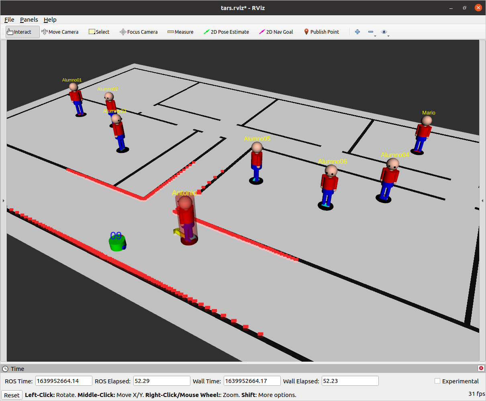
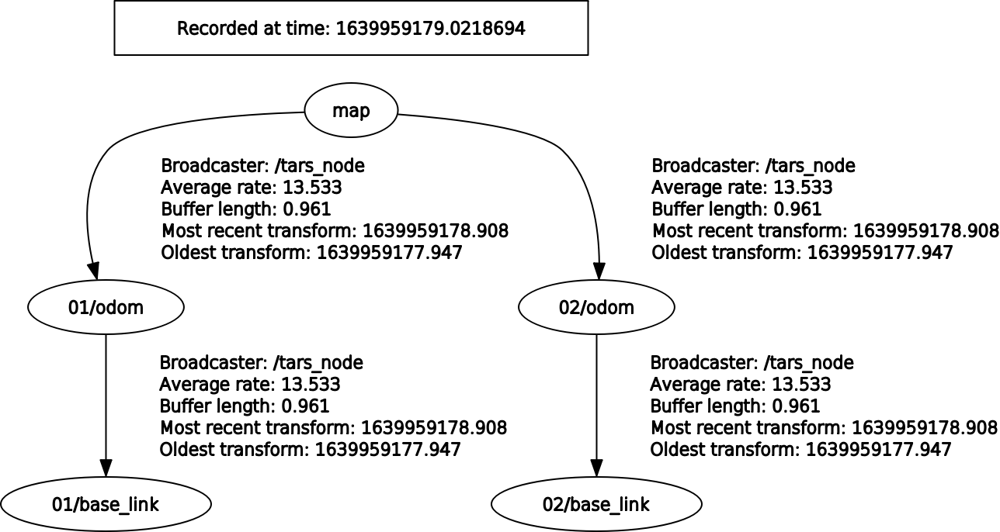

# TARS is Another Robot Simulator
A ROS multi-agent simulator based on the Social Force Model (SFM). It includes two types of agents:

* **Humans** move randomly between points of interest following the A* algorithm for global planning and the SFM for local planning. The graph structure is given by the user, the edge weights are dynamic and depends on the length of the corresponding edge and the number of humans in transit. The desired velocity and the list of points of interest in the map can be configured individually for each agent.

* Dual-wheeled **robots** following velocity commands. Each robot publish its own odometry, laser scan and people detection. Each one is subscribed to its own *cmd_vel* topic to receive velocity commands. The robot radius, number of laser scan readings, laser scan range and people detection range can be configured individually for each one.

The simulator has been developed as a lightweight ROS package and includes cool RVIZ visualization, the number of dependencies has been minimized for optimal execution. It has been successfully tested on ROS Noetic, Melodic and Kinetic. 

## Social Force Model

The SFM used by TARS is based on the model proposed by Helbing and Molnar:

-  Helbing, Dirk & Molnar, Peter. (1998). *Social Force Model for Pedestrian Dynamics*. Physical Review E. 51. 10.1103/PhysRevE.51.4282. 

## Installation and quick start

Clone this repository in the source folder of your catkin workspace and compile with catkin_make. Packages *map_server* and *rviz* are recommended.

1. cd \~/catkin_ws/src
2. git clone https://github.com/Ignacio-Perez/TARS 
3. cd ..
4. catkin_make

You can launch a test scenario as follows:

1. roslaunch tars ccia_h.launch

## Nodes

* **tars_node** is the simulator node.
  - Parameters:
    - scenario: The path to the scenario file.

## Topics

* **/tars/agents**
  - Type: tars/AgentsMsg
  - Description: List of running agents 

* **/tars/XX/odom**:
  - Type: nav_msgs/Odometry
  - Description: Odometry published by robot XX

* **/tars/XX/scan**
  - Type: sensor_msgs/LaserScan
  - Description: Laser scan published by robot XX

* **/tars/XX/agents_tracking**
  - Type: tars/AgentsMsg
  - Description: Agents (humans and/or robots) being tracked by robot XX (including itself)

* **/tars/XX/cmd_vel**
  - Type: geometry_msgs/Twist
  - Description: Velocity command subscribed by robot XX

* **/tars/visualization/XX/agents_tracking**
  - Type: visualization_msgs/MarkerArray
  - Description: RVIZ visualization for agents being tracked by robot XX

* **/tars/visualization/agents**
  - Type: visualization_msgs/MarkerArray
  - Description: RVIZ visualization for agents

* **/tars/visualization/edges**
  - Type: visualization_msgs/MarkerArray
  - Description: RVIZ visualization for A* edges. The alpha value indicates the current edge weight. 

* **/tars/visualization/nodes**
  - Type: visualization_msgs/MarkerArray
  - Description: RVIZ visualization for A* nodes.

* **/tars/visualization/forces**
  - Type: visualization_msgs/MarkerArray
  - Description: RVIZ visualization for SFM forces.

## Messages
* **tars/Vector2DMsg**
  - Structure:
    - float64 x
    - float64 y
  - Description: Generic messsage for two-dimensional vectors

* **tars/ForceMsg**
  - Structure:
    - tars/Vector2DMsg desiredForce
    - tars/Vector2DMsg obstacleForce
    - tars/Vector2DMsg socialForce
    - tars/Vector2DMsg globalForce
  - Descripion: Message for SFM forces 

* **tars/AgentMsg**
  - Structure:
    - string id # it should be unique
    - uint8 type # 0: robot; 1: human
    - float64 radius
    - tars/Vector2DMsg position
    - float64 yaw
    - tars/Vector2DMsg velocity
    - tars/Vector2DMsg goal
    - bool hasForces # SFM forces are being computed? False by default for robot agents, true for human agents.
    - tars/ForcesMsg forces
  - Description: Message for a running agent. 

* **tars/AgentsMsg**
  - Structure:
    - std_msgs/Header header
    - uint32 size
    - tars/AgentMsg[] agents

## Services

* **/tars/robot_goal**
  - Type: tars/RobotGoalSrv
  - Args: 
    - string id
    - float64 gx  
    - float64 gy
  - Return:
    - bool error
  - Description: Set the goal (gx,gy) for robot id. Then the SFM forces for such a robot can be computed. It returns true if error, false otherwise.

## TF

The next TF diagram shows an example for two robots called 01 and 02. 

## The scenario file

The scenario file follows a pseudo YAML format with the next items:

* **freq**: The execution frequency of the simulator.
* **map**: The YAML map file.
* **forceFactorDesired**: SFM parameter.
* **forceFactorObstacle**: SFM parameter.
* **forceFactorSocial**: SFM parameter.
* **obstacleReadings**: Number of obstacle readings to be considered in order to compute the SFM obstacle force.
* **lambda**: SFM parameter.
* **gamma**: SFM parameter.
* **n1**: SFM parameter.
* **n2**: SFM parameter.
* **relaxationTime**: SFM parameter.
* **robot**: A robot agent to be included with the next parameters:
   - id
   - desiredVelocity
   - radius
   - scan readings
   - scan range
   - agent detection range
   - x
   - y
   - yaw
* **node**: A node in the graph with the next parameters:
  - id
  - x
  - y
* **goal**: A goal (point of interest) in the graph with the next parameters:
  - id 
  - x
  - y
  - orientation
* **human**: A human agent with the next parameters:
  - id
  - desiredVelocity
  - List of points of interest

For an example, see *scenarios/ccia_h.scenario.yaml*    

